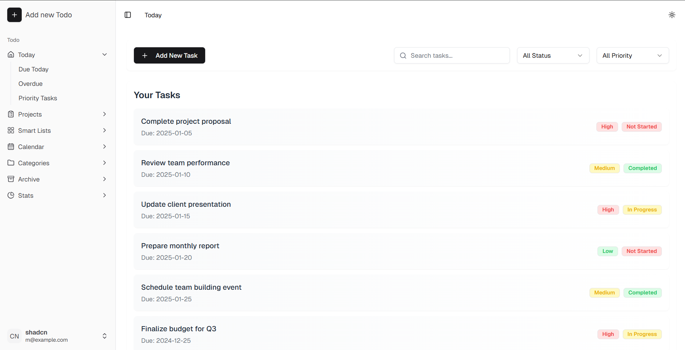

# Smart Todo Application

A comprehensive task management system built with Turborepo and modern web technologies. This project is currently in active development.

## 📸 Screenshot

<div align="center">
  
</div>

*Clean and intuitive task management interface with priority badges and status indicators*

## ✨ Features

- **Project-Todo Correlation**: Assign todos to specific projects for better organization
- **Smart Lists**: Automatically organized todo lists based on priority and status
- **Multiple Views**:
  - Calendar view for temporal task organization
  - Weekly view for short-term planning
- **Priority Management**: Visual priority badges for task importance (High/Medium/Low)
- **Status Tracking**: Clear status indicators (Not Started/In Progress/Completed)
- **Statistics Dashboard**: Track your productivity and task completion metrics

## 🚀 Tech Stack

- **Frontend**: Next.js with React
- **Backend**: Express.js & Node.js
- **Database**: PostgreSQL
- **UI Components**: shadcn/ui
- **Monorepo Management**: Turborepo
- **Styling**: Tailwind CSS

## 🛠️ Installation

1. Clone the repository:
```bash
git clone [your-repository-url]
```

2. Install Turborepo globally:
```bash
npm install turbo -g
```

3. Install dependencies:
```bash
cd [project-directory]
pnpm install
```

4. Set up your environment variables:
```bash
cp .env.example .env
```

5. Start the development server:
```bash
turbo dev
```

## 📁 Project Structure

```
apps/
  ├── web/           # Next.js frontend application
  └── api/           # Express.js backend server
packages/
  ├── ui/            # Shared UI components
  ├── config/        # Shared configuration
  ├── tsconfig/      # TypeScript configuration
  └── utils/         # Shared utilities
```

## 🚦 Available Commands

```bash
# Development
turbo dev            # Start all applications in development mode

# Building
turbo build          # Build all applications and packages

# Testing
turbo test          # Run tests across applications

# Linting
turbo lint          # Lint all applications and packages
```

## 🌐 Development Status

⚠️ This project is currently in active development. Features and documentation may change frequently.

## 📝 License

[Your License] - see the [LICENSE.md](LICENSE.md) file for details

## 🤝 Contributing

Contributions are welcome! Please feel free to submit a Pull Request.

---
Built with ❤️ using [Turborepo](https://turborepo.org/)
